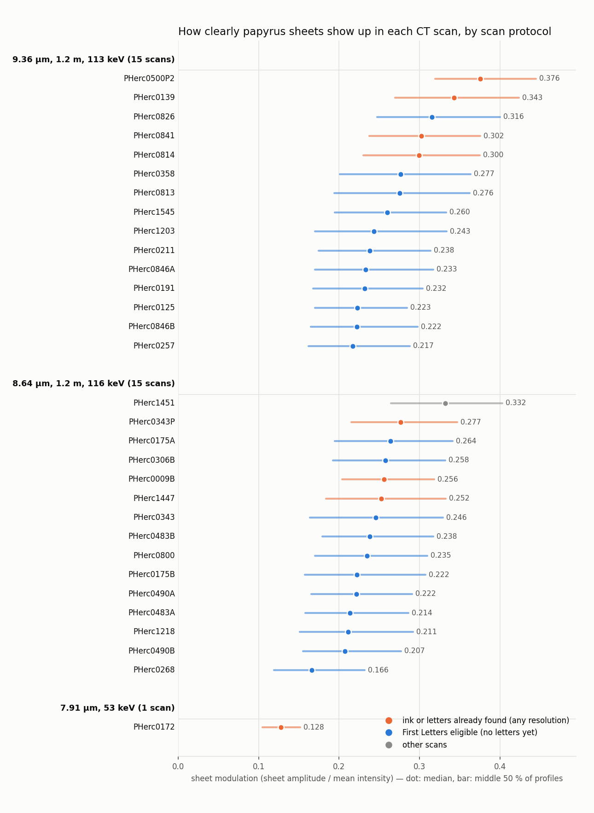
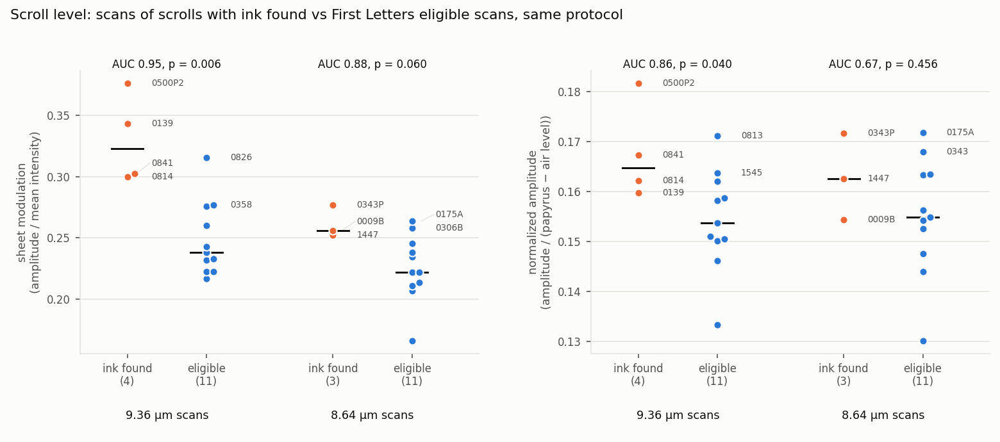
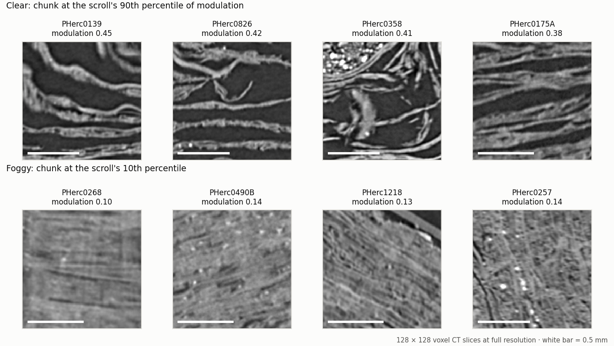
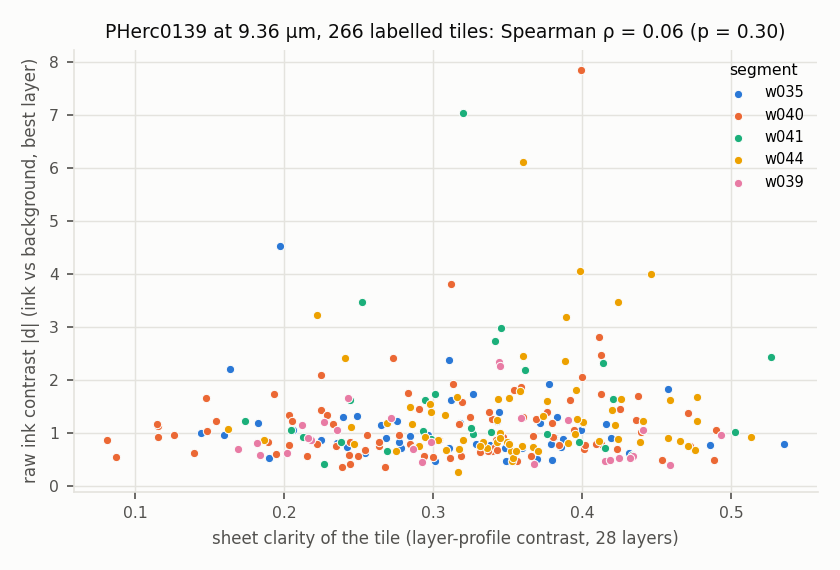

# First Letters Scan Atlas

**How clearly the papyrus sheets show up in the CT scan of every First Letters scroll, whether that
goes with ink having been found, and which scrolls are ready for the official spiral workflow.**

Everything here runs on a CPU. The tools read the Vesuvius Challenge open data straight from the
public bucket (about 400 MB and one to two minutes per scroll on a 2-core machine): no GPU, no
machine learning, nothing to download first.

## In short

- **An atlas of 31 CT scans:** the 22 First Letters eligible scrolls, 8 scans of scrolls where ink
  or letters have been found, and PHerc1451. For each scan it measures how strongly the
  sheet-to-sheet pattern stands out in the CT (the *sheet modulation*), with 95 % intervals.
- **At the scroll level it goes with ink having been found.** Among the 9.36 µm scans, the 4 scans
  of scrolls with ink found all score higher than 10 of the 11 eligible scans (AUC 0.95, exact
  p = 0.006). A version of the measure that ignores intensity offsets gives AUC 0.86 (p = 0.04).
  In the 8.64 µm scans the evidence is weak (3 against 11 scans: AUC 0.88, p = 0.06, and 0.67
  offset-free).
- **The eligible scans that look most like the ink-found ones** are PHerc0826, PHerc0358,
  PHerc0813 and PHerc1545: the top four of the 9.36 µm eligible scans by both measures. The
  foggiest eligible scan is PHerc0268.
- **It does not tell where on a sheet ink will show.** Inside PHerc0139's labelled 9 µm segments,
  tiles with clearer sheets do not have stronger raw ink contrast (Spearman ρ = 0.06, p = 0.30,
  266 tiles). Use the atlas to choose scrolls, not patches.
- **Ready-to-edit `spiral-scroll.json` files for 10 eligible scrolls**, 9 of which have every input
  the official spiral workflow needs. All 10 pass villa's own parser once the outward sense is set.
- **Spiral-fit meshes: rough, but that is not why they render flat.** Published spiral-fit windings of PHerc0211 are
  about 2 to 4 times rougher than published segments and auto-grown patches. Smoothing one of them
  until it is as smooth as a published mesh leaves its render contrast where it was (0.03–0.09,
  against 0.13–0.31 for a published PHerc0139 mesh rendered by the same code).
- **A negative result:** our two automatic ways to find `spiral_outward_sense` from the scan were
  not reliable, so the tool never guesses it.

PHerc1447 left the eligible list on 24 September 2026 (villa
[#1887](https://github.com/ScrollPrize/villa/pull/1887); the prizes page now "excludes those where
letters have now been found"); it is counted here with the ink-found scans.

## Why this exists

A First Letters attempt costs hours of GPU time: a spiral fit, rendering and ink inference. Public
attempts on PHerc0211 (armando-gaona, bnleft) and PHerc0826 (Miller & Müller; ShribyrLabs, over
three bands and 21 patches) have not reported letters. armando-gaona measured that PHerc0211's raw
sheet contrast is 1.4 times lower than PHerc0139's, which explains only part of a 4.7-fold loss of
render contrast. The official open problems page says that when ink does not appear, "the limiting
factor has to be assessed scroll by scroll". This atlas measures one scan-side factor, how well the
sheets stand out from each other, for every eligible scroll with the same method, so the next
attempt can start where the scan is clearest and a null result can be read against the scan it came
from.

## 1. Scroll-level sheet contrast



**Does it go with ink being found?** We compared the scans of scrolls where ink or letters have been
found (8 scans; the list and its source are under *Data and credits*) with the eligible scans
(22), within the same scan protocol, since the beamline setup changes the contrast. AUC is the
chance that a random ink-found scan scores higher than a random eligible scan (0.5 = no link);
p is the exact two-sided Mann–Whitney test.

| Scans compared | Ink found vs eligible | Sheet modulation: AUC (p) | Offset-free amplitude: AUC (p) | Periodicity: AUC (p) |
|---|---|---|---|---|
| All protocols | 8 vs 22 | 0.78 (0.02) | 0.81 (0.010) | 0.53 (0.84) |
| 9.36 µm scans | 4 vs 11 | 0.95 (0.006) | 0.86 (0.04) | 0.64 (0.49) |
| 8.64 µm scans | 3 vs 11 | 0.88 (0.06) | 0.67 (0.46) | 0.30 (0.37) |
| 9.36 µm scans without PHerc0500P2 (fragment) | 3 vs 11 | 0.94 (0.02) | 0.82 (0.13) | 0.58 (0.77) |



- **9.36 µm scans:** the 4 ink-found scans (PHerc0500P2, PHerc0139, PHerc0841, PHerc0814) sit
  above every eligible scan except PHerc0826. The result holds without the one detached fragment,
  PHerc0500P2 (AUC 0.94, p = 0.02). It would not survive a Bonferroni correction over the 12 tests
  in the table (0.006 × 12 = 0.07), so read it as good evidence from few scrolls, not proof.
- **Offset-free check.** Modulation divides the sheet amplitude by the mean intensity, so a scan
  whose intensities sit on a higher baseline scores lower. The offset-free measure divides by the
  scan's range from air to papyrus instead. It agrees in the 9.36 µm scans (AUC 0.86, p = 0.04) and
  is weaker in the 8.64 µm scans (0.67, p = 0.46). The offset matters most for PHerc0172, an older
  7.91 µm scan of a scroll whose title has been found: its air level is 105 grey levels, against
  13 to 39 in every other scan, which is why its modulation is the lowest of all (0.128). It is the
  only scan with that protocol, so it enters no within-protocol test.
- **What the measure sees.** It is high where sheets are separated by gaps and low where they are
  packed together (see the chunks below), the "compressed region" haze the open problems page
  describes. How well a single sine fits the profile (*periodicity*) does not separate the groups
  in any protocol, so what differs is the contrast of the sheets, not their regularity.
- **Association, not cause.** Ink was found where people looked hardest (several of these scrolls
  also have ~2 µm scans or labelled segments), and letters in PHerc0814 and PHerc0841 were found in
  ~2 µm scans, not in the ~9 µm scans measured here. A clear scan is not a promise of letters.

**Scan protocol 9.36 µm, 1.2 m, 113 keV** (15 scans)

| Scroll | Group | Sheet modulation (95 % CI) | Offset-free amplitude | Sheet spacing | Foggy | Incoherent |
|---|---|---|---:|---:|---:|---:|
| PHerc0500P2 | ink found | 0.376 (0.368–0.385) | 0.182 | 142 µm | 1 % | 19 % |
| PHerc0139 | ink found | 0.343 (0.331–0.356) | 0.160 | 153 µm | 2 % | 10 % |
| PHerc0826 | eligible | 0.316 (0.302–0.329) | 0.162 | 153 µm | 3 % | 22 % |
| PHerc0841 | ink found | 0.302 (0.292–0.315) | 0.167 | 151 µm | 4 % | 18 % |
| PHerc0814 | ink found | 0.300 (0.287–0.310) | 0.162 | 132 µm | 4 % | 14 % |
| PHerc0358 | eligible | 0.277 (0.260–0.295) | 0.159 | 138 µm | 12 % | 16 % |
| PHerc0813 | eligible | 0.276 (0.258–0.294) | 0.171 | 150 µm | 13 % | 13 % |
| PHerc1545 | eligible | 0.260 (0.247–0.272) | 0.164 | 140 µm | 10 % | 30 % |
| PHerc1203 | eligible | 0.243 (0.227–0.261) | 0.158 | 163 µm | 17 % | 20 % |
| PHerc0211 | eligible | 0.238 (0.226–0.252) | 0.151 | 141 µm | 16 % | 21 % |
| PHerc0846A | eligible | 0.233 (0.216–0.248) | 0.150 | 146 µm | 18 % | 31 % |
| PHerc0191 | eligible | 0.232 (0.218–0.247) | 0.150 | 144 µm | 18 % | 22 % |
| PHerc0125 | eligible | 0.223 (0.212–0.232) | 0.133 | 151 µm | 16 % | 37 % |
| PHerc0846B | eligible | 0.222 (0.211–0.236) | 0.146 | 145 µm | 19 % | 30 % |
| PHerc0257 | eligible | 0.217 (0.207–0.229) | 0.154 | 145 µm | 20 % | 33 % |

**Scan protocol 8.64 µm, 1.2 m, 116 keV** (15 scans)

| Scroll | Group | Sheet modulation (95 % CI) | Offset-free amplitude | Sheet spacing | Foggy | Incoherent |
|---|---|---|---:|---:|---:|---:|
| PHerc1451 | other | 0.332 (0.322–0.341) | 0.164 | 143 µm | 2 % | 6 % |
| PHerc0343P | ink found | 0.277 (0.263–0.290) | 0.172 | 140 µm | 6 % | 20 % |
| PHerc0175A | eligible | 0.264 (0.249–0.278) | 0.172 | 155 µm | 12 % | 15 % |
| PHerc0306B | eligible | 0.258 (0.246–0.271) | 0.153 | 148 µm | 11 % | 20 % |
| PHerc0009B | ink found | 0.256 (0.245–0.266) | 0.154 | 156 µm | 7 % | 31 % |
| PHerc1447 | ink found | 0.252 (0.237–0.267) | 0.163 | 155 µm | 13 % | 24 % |
| PHerc0343 | eligible | 0.246 (0.226–0.263) | 0.168 | 159 µm | 20 % | 23 % |
| PHerc0483B | eligible | 0.238 (0.225–0.252) | 0.163 | 149 µm | 14 % | 24 % |
| PHerc0800 | eligible | 0.235 (0.221–0.248) | 0.156 | 158 µm | 17 % | 25 % |
| PHerc0175B | eligible | 0.222 (0.208–0.237) | 0.155 | 163 µm | 22 % | 20 % |
| PHerc0490A | eligible | 0.222 (0.211–0.234) | 0.163 | 156 µm | 19 % | 28 % |
| PHerc0483A | eligible | 0.214 (0.201–0.227) | 0.154 | 150 µm | 21 % | 30 % |
| PHerc1218 | eligible | 0.211 (0.195–0.228) | 0.147 | 146 µm | 24 % | 27 % |
| PHerc0490B | eligible | 0.207 (0.196–0.220) | 0.144 | 145 µm | 23 % | 34 % |
| PHerc0268 | eligible | 0.166 (0.155–0.179) | 0.130 | 173 µm | 42 % | 38 % |

**Scan protocol 7.91 µm, 53 keV** (1 scan)

| Scroll | Group | Sheet modulation (95 % CI) | Offset-free amplitude | Sheet spacing | Foggy | Incoherent |
|---|---|---|---:|---:|---:|---:|
| PHerc0172 | ink found | 0.128 (0.125–0.131) | 0.183 | 148 µm | 74 % | 21 % |

Columns: sheet modulation is the median over coherent profiles, with a 95 % bootstrap interval over
chunks; offset-free amplitude is described under *Method*; sheet spacing is the median distance
between sheets; *foggy* is the share of the kept profiles with modulation below 0.15; *incoherent*
is the share of profiles dropped because the local sheet orientation is unclear (coherence < 0.3).
For PHerc0268, 42 % of the kept profiles are foggy and 38 % were dropped, so 64 % of the sampled
profiles are foggy or unclear.



**Height.** Per-height-band values are in `data/atlas/atlas_height_bands.json`. After correcting for
31 scans, no band is clearer than chance in a chunk-level permutation test (smallest p = 0.0025,
PHerc0490B at 8–17 % of its scan volume's height; `data/atlas/atlas_height_band_tests.json`), so we
do not recommend particular heights.

## 2. Local clarity and raw ink contrast (a negative result)



If sheet clarity also worked locally, it could point to patches worth rendering. We tested that on
five PHerc0139 segments that have ink labels on the 9.362 µm volume (w035, w039, w040, w041,
w044). For every 128 × 128 tile of the published surface volume with at least 300 ink and 300
background pixels inside the supervision mask we measured the tile's sheet clarity (contrast of its
mean profile across the 28 layers) and its raw ink contrast (the largest standardized ink–background
difference over the layers). Across 266 tiles the two are unrelated: Spearman ρ = 0.06 (p = 0.30);
the median ink contrast is 0.94, 0.92 and 1.03 in the least clear, middle and clearest thirds.
Using the signed difference instead gives ρ = 0.13 (p = 0.03), too weak to guide patch choice.

## 3. Readiness for the official spiral workflow

| Scroll | Voxel size | Lasagna normals (group / scale) | Tracks | Umbilicus | Sheet modulation | All spiral inputs |
|---|---|---|---|---|---:|---|
| PHerc0826 | 9.362 µm | yes (2 / 4) | yes | official | 0.316 | **yes** |
| PHerc0358 | 9.362 µm | yes (2 / 4) | yes | community (manual) | 0.277 | **yes** |
| PHerc0813 | 9.362 µm | yes (2 / 4) | yes | community (manual) | 0.276 | **yes** |
| PHerc0211 | 9.362 µm | yes (2 / 4) | yes | official | 0.238 | **yes** |
| PHerc0800 | 8.64 µm | yes (2 / 4) | yes | community (manual) | 0.235 | **yes** |
| PHerc0191 | 9.362 µm | yes (2 / 4) | yes | community (manual) | 0.232 | **yes** |
| PHerc0125 | 9.362 µm | yes (2 / 4) | yes | official | 0.223 | **yes** |
| PHerc0257 | 9.362 µm | yes (2 / 4) | yes | community (manual) | 0.217 | **yes** |
| PHerc0268 | 8.64 µm | yes (2 / 4) | yes | community (manual) | 0.166 | **yes** |
| PHerc0175A | 8.64 µm | no | yes | none | 0.264 | no |
| PHerc1545 | 9.362 µm | yes (2 / 4) | no | community (manual) | 0.260 | no |
| PHerc0306B | 8.64 µm | no | yes | none | 0.258 | no |
| PHerc0343 | 8.64 µm | yes (2 / 4) | yes | none | 0.246 | no |
| PHerc1203 | 9.362 µm | yes (2 / 4) | no | community (manual) | 0.243 | no |
| PHerc0483B | 8.64 µm | no | yes | none | 0.238 | no |
| PHerc0846A | 9.362 µm | no | yes | none | 0.233 | no |
| PHerc0175B | 8.64 µm | no | yes | none | 0.222 | no |
| PHerc0490A | 8.64 µm | no | yes | none | 0.222 | no |
| PHerc0846B | 9.362 µm | no | no | none | 0.222 | no |
| PHerc0483A | 8.64 µm | no | yes | none | 0.214 | no |
| PHerc1218 | 8.64 µm | yes (2 / 4) | no | community (manual) | 0.211 | no |
| PHerc0490B | 8.64 µm | no | yes | none | 0.207 | no |

`data/readiness/spiral-scroll/` has a generated `spiral-scroll.json` for each of the 10 scrolls
with tracks and Lasagna normals. Each file takes `voxel_size_um` from the volume name,
`normal_zarr_group` from the group the Lasagna job itself used for its `nx`/`ny` output,
`lasagna_scale` from that group's downsample factor in the store's `.zattrs`, and
`paths.tracks_dbm` from the published spiral dataset. `spiral_outward_sense` is left as `CW|ACW`
unless it has been published (only PHerc0826, `CW`, in the spiral-fitting README), so villa's
`fit_session.parse_scroll_spec` rejects those files until someone sets it; with it set, all 10 pass.
The PHerc0826 file matches the published example field for field, plus two informational keys
(`_generated_by`, `_notes`) that the parser ignores. PHerc0343 has tracks and normals but no
umbilicus, so it is not counted as ready.

## 4. Spiral-fit meshes: rough, but roughness is not what flattens their renders

armando-gaona reported that renders from their PHerc0211 spiral-fit windings have 4.7 times less
sheet contrast than a published PHerc0139 mesh, and the atlas puts a factor of 1.44 of that in the
scan itself (0.238 against 0.343). We checked whether mesh roughness explains the rest.

**Roughness.** `tools/mesh_roughness.py` measures how bumpy a tifxyz mesh is: the RMS second
difference of the vertex grid along the surface normal, rescaled to the nominal 20-voxel grid step.

| Mesh | Kind | Grid step, median (5–95 %) | Roughness u / v (voxels) |
|---|---|---|---|
| 20250108000000-w025_2025010863 | published segment, PHerc0139 | 20.0 (19.5–20.3) | 1.8 / 2.1 |
| 20250108000001-w026_2025010854 | published segment, PHerc0139 | 20.0 (19.5–20.3) | 1.6 / 2.1 |
| 20250108000002-w027_2025010845 | published segment, PHerc0139 | 20.0 (19.5–20.3) | 1.6 / 2.0 |
| 20251028213516-auto_grown_20251028213516907 | auto-grown patch, PHerc0800 | 20.1 (19.9–20.3) | 1.6 / 2.0 |
| 20251028220042-auto_grown_20251028220042762 | auto-grown patch, PHerc0800 | 20.1 (19.9–20.3) | 1.6 / 2.1 |
| 20251028220955-auto_grown_20251028220955262 | auto-grown patch, PHerc0800 | 20.1 (19.9–20.4) | 1.8 / 2.3 |
| 20250502180708-auto_grown_20250502160708188 | auto-grown patch, PHerc1447 | 20.0 (19.9–20.1) | 1.5 / 1.6 |
| 20250502180748-auto_grown_20250502160748721 | auto-grown patch, PHerc1447 | 20.1 (20.0–20.2) | 1.5 / 1.6 |
| 20250502182142-auto_grown_20250502161324419 | auto-grown patch, PHerc1447 | 20.0 (19.9–20.2) | 1.3 / 1.4 |
| 20260317000000-w035_2026031718 | published segment, PHerc0139 | 20.0 (19.6–20.3) | 1.8 / 2.2 |
| w030 | spiral-fit winding, PHerc0211 (armando-gaona) | 20.0 (15.0–41.8) | 7.0 / 4.7 |
| w050 | spiral-fit winding, PHerc0211 (armando-gaona) | 19.5 (14.7–51.2) | 7.9 / 4.7 |
| w070 | spiral-fit winding, PHerc0211 (armando-gaona) | 23.9 (14.6–63.3) | 7.3 / 5.4 |
| w090 | spiral-fit winding, PHerc0211 (armando-gaona) | 25.9 (15.8–64.9) | 6.6 / 5.3 |

The four fitted windings (the `wNNN` meshes, not the `_spliced` ones) are 4.4 times rougher along
the grid columns (u) and 2.4 times along the rows (v) than the 10 published segments and auto-grown
patches (ratios of medians). Their grid steps vary from about 15 to 65 voxels, which makes a
second difference a rougher measure, so read this as "about 2 to 4 times".

**Does smoothing restore contrast?** `tools/render_contrast.py` renders 28 layers along the normal
for a 400 × 400-voxel block of a mesh, straight from the bucket, and measures the contrast of each
128 × 128 tile's mean layer profile, the same kind of measure armando-gaona used. We rendered three
blocks of the PHerc0211 winding w070 and three blocks of the published PHerc0139 segment w035, each
as published and after Gaussian smoothing of the vertex grid (σ = 1.5 and 3 grid cells):

| Mesh, block (grid rows, cols) | As published: roughness u / v → contrast | σ = 1.5 cells | σ = 3 cells |
|---|---|---|---|
| PHerc0211 w070 (spiral fit), 15:36, 60:81 | 13.3 / 5.2 → **0.072** | 1.5 / 1.0 → **0.086** | 0.3 / 0.5 → **0.068** |
| PHerc0211 w070 (spiral fit), 25:46, 160:181 | 4.2 / 6.0 → **0.030** | 2.1 / 1.5 → **0.029** | 1.4 / 0.8 → **0.027** |
| PHerc0211 w070 (spiral fit), 35:56, 260:281 | 5.0 / 5.5 → **0.094** | 2.7 / 1.1 → **0.082** | 1.8 / 0.7 → **0.062** |
| PHerc0139 w035 (published), 60:81, 60:81 | 1.6 / 1.5 → **0.294** | 0.6 / 0.5 → **0.285** | 0.4 / 0.2 → **0.242** |
| PHerc0139 w035 (published), 135:156, 130:151 | 1.5 / 1.9 → **0.309** | 0.7 / 0.8 → **0.282** | 0.4 / 0.5 → **0.232** |
| PHerc0139 w035 (published), 200:221, 180:201 | 1.4 / 2.0 → **0.127** | 0.4 / 1.1 → **0.136** | 0.2 / 0.6 → **0.132** |

Smoothing brings w070 close to the roughness of the published meshes (σ = 1.5) or below it (σ = 3),
and its render contrast stays at 0.03–0.09; the published mesh stays at 0.13–0.31. So roughness is not what flattens these renders.
On PHerc0139 the published mesh keeps 37–90 % of the scan's sheet modulation (0.343); the same share
of PHerc0211's 0.238 would be 0.09–0.21, and the fitted winding sits at or below the bottom of that
range. What is left is where the fitted surface sits relative to the sheets over millimetres, or
something neither we nor armando-gaona have tested (they found that the surface is not simply
off-centre and that the fit's tangent follows the sheets at 0.99, against 0.996 for the published
mesh). This is one winding
and three blocks per mesh: a pointer for whoever fits spirals next, not a verdict on the method.

## 5. What did not work: finding the spiral's outward sense automatically

The spiral fit needs `spiral_outward_sense` (`CW` or `ACW`), and it is published only for
PHerc0826 (`CW`). We tried two ways to read it from the data on PHerc0826:

- a least-squares "winding coordinate" fit in single slices of the Lasagna predictions, which
  solves for the jump in layer number after one turn around the umbilicus (it should be ±1): over
  8 slices it voted 5 `CW` against 3 `ACW`, with jumps from −7.4 to +3.3
  (`experiments/outward_sense/`, reproducible with the command in `sense_scan.py`);
- tracing one sheet around a full turn with the Lasagna normals, which jumped between sheets.

Neither is reliable, and armando-gaona reported a similar failure with track angles (55–58 %
agreement). The tool therefore leaves the sense for a person to set after a look in VC3D.

## Method

- **Sampling.** Level-0 chunks (128³ voxels) fully inside the scroll, stratified by height
  (12 bands) and by depth (3 rings around the centre of the scroll's cross-section), up to 5 chunks
  per cell: 119 to 180 chunks per scan.
- **Sheet orientation.** 3D structure tensor in each chunk (gradient σ = 1, tensor σ = 4 voxels);
  its main eigenvector is the local sheet normal and `coherence = (λ1 − λ2) / (λ1 + λ2)`.
- **Sheet signal.** At 40 random points per chunk, an 81-voxel CT profile along the normal;
  Hann-windowed, zero-padded FFT; the strongest period between 5 and 40 voxels is the sheet
  spacing (sub-bin peak). Its amplitude divided by the profile's mean intensity is the **sheet
  modulation**. Profiles with coherence below 0.3 are dropped (6 to 38 % of them, most in foggy
  scans).
- **Offset-free amplitude.** The median sheet amplitude divided by the scan's range from air to
  papyrus: the papyrus level is the 95th percentile of the sampled chunks' 98th percentiles and the
  air level the 5th percentile of their 2nd percentiles, leaving out chunks that touch the zeroed,
  masked part of the volume.
- **Periodicity.** The share of a profile's variance explained by a sine at the sheet period.
- **Uncertainty.** Medians with 95 % bootstrap intervals that resample chunks, not profiles.
  Group comparisons use exact two-sided Mann–Whitney tests; height bands use a permutation test
  that shuffles band labels between chunks.
- **Accuracy check** (`tests/test_scanq_synthetic.py`): on synthetic sinusoidal sheets of known
  period, contrast and orientation, with noise, the period is recovered within 0.01 voxels
  (median), the modulation with a median bias of −1.1 % (worst −3.5 %), and the normal within 0.36°
  (median; worst 1.0°). Real sheets are not sinusoids, so this checks the arithmetic, not the model.

## Limitations

- **Compare scans of the same protocol.** Contrast depends on the beamline setup; the tables are
  split by protocol and the tests are run within protocol.
- **Few positives.** 4 ink-found scans at 9.36 µm and 3 at 8.64 µm. The results can change as ink
  is found in more scrolls.
- **The positive group is only as good as the public record.** "Ink detected" in the catalogue does
  not mean letters were read, and scrolls without reported ink may simply not have been searched.
- **Not every scroll is here.** Scrolls whose only scans in the bucket are ~1–2 µm or 45 µm
  (PHercParis4, PHerc1667, PHercParis3, PHerc0332, PHerc1299) are not included.
- **Sampling, not full coverage.** 119 to 180 chunks per scan. Depth rings are measured from the
  centre of the scroll's cross-section, not from the umbilicus.

## Run it

```bash
pip install -r requirements.txt

# 1. metadata of every scroll in the bucket (volumes, Lasagna, umbilicus, spiral datasets)
python tools/catalog_check.py                        # writes catalog_report.json

# 2. sample scans (~1-2 min and ~400 MB per scroll); the tables use the 31 scrolls in data/atlas
python tools/scanq.py PHerc0826 PHerc0139 PHerc0268 --per-bin 5 --nz 12 --outdir out --cache cache

# 3. tables, tests and figures from the samples (the shipped samples are in data/atlas)
python tools/make_report.py out out                  # atlas_summary.*, height bands and their test
python tools/scroll_level_test.py out out figures/scroll_level_measures.png
python tools/atlas_figs.py out figures --examples PHerc0139:high PHerc0826:high PHerc0358:high \
    PHerc0175A:high PHerc0268:low PHerc0490B:low PHerc1218:low PHerc0257:low --cache cache

# 4. readiness matrix and spiral-scroll.json files
git clone https://github.com/AlexeyDrobkovStrikesBack/herculaneum-umbilici
python tools/readiness.py --report catalog_report.json --scanq out \
    --umbilici herculaneum-umbilici --out readiness

# 5. meshes: roughness of any tifxyz folders, and render contrast of a block (as published and smoothed)
python tools/mesh_roughness.py <tifxyz_dir> [<tifxyz_dir> ...]
python tools/render_contrast.py <armando-repo>/meshes/w070 \
    https://vesuvius-challenge-open-data.s3.us-east-1.amazonaws.com/PHerc0211/volumes/20250821151803-9.362um-1.2m-113keV-masked.zarr \
    --rows 25:46 --cols 160:181 --smooth 0 1.5 3 --cache cache

# 6. the local ink test on PHerc0139 (writes ink_vs_clarity.json and .png in the current folder;
#    --plot <json> <png> redraws the figure from a saved run)
python tools/ink_vs_clarity.py 20260317000000-w035_2026031718 20260302000000-w039_2026030210 \
    20250831000000-w040_2025083102 20260108000000-w041_2026010816 20260115000000-w044_2026011522

python tests/test_scanq_synthetic.py
```

To rebuild the shipped tables and figures without downloading anything, point steps 3 and 4 at
`data/atlas` (for example `python tools/make_report.py data/atlas /tmp/check`); this reproduces the
shipped files byte for byte. Sampling is seeded: a fresh run of step 2 on PHerc0826 from a clean
copy reproduces `data/atlas/profiles/scanq_PHerc0826.npz` exactly. The published meshes in section 4
are in the bucket under `<scroll>/segments/<id>/`; the fitted windings are in armando-gaona's
repository under `meshes/`. `tools/vcz.py` is a small OME-Zarr v2 reader (numpy, requests and
numcodecs) that reads any box of any pyramid level over HTTPS; `tools/shard_v3.py` reads the sharded
zarr v3 ink labels. Both work on Windows and need neither `zarr` nor `s3fs`.

## Files

- `data/atlas/`: per-scan samples (`scanq_<scroll>.json`, `profiles/scanq_<scroll>.npz`),
  `atlas_summary.csv/.json`, `scroll_level_measures.json`, `scroll_level_tests.json`, height bands
  and their tests.
- `data/readiness/`: `readiness.csv/.json` and `spiral-scroll/<scroll>.json`.
- `data/ink_vs_clarity/ink_vs_clarity.json`: the 266 PHerc0139 tiles.
- `data/mesh_roughness/mesh_roughness.jsonl` and `data/render_contrast/render_contrast.jsonl`:
  section 4.
- `data/catalog_report.json`: metadata check of every scroll in the bucket.
- `experiments/outward_sense/`: the failed outward-sense experiment of section 5 and its result.

## Data and credits

- CT volumes, surface volumes, ink labels, meshes and spiral datasets: Vesuvius Challenge open data
  (`vesuvius-challenge-open-data` bucket, `dl.ash2txt.org`).
- Scrolls with ink or letters found: the `textFound` field of `scrollprize.org/src/data/atlasOverlay.json`
  in villa at commit 75c79ac (24 Sep 2026): "Title found" for PHerc0139 and PHerc0172, "Ink detected"
  for PHerc0009B, PHerc0343P, PHerc0500P2, PHerc0814 and PHerc0841; plus PHerc1447 (villa #1887).
  Letters in PHerc0814 and PHerc0841 were reported in ~2 µm scans ("Multiple scrolls now show Greek
  letters", Vesuvius Challenge, 9 October 2025).
- First Letters eligibility: `prizeEligibility.json` in villa at the same commit (22 volumes).
- Community umbilici for 10 scrolls: Alexey Drobkov,
  <https://github.com/AlexeyDrobkovStrikesBack/herculaneum-umbilici> (MIT).
- Spiral-fit windings w030–w090, the 1.4× raw-contrast measurement, the 4.7× render-contrast gap and
  the placement tests quoted in section 4: armando-gaona,
  <https://github.com/armando-gaona/pherc0211-first-letters-free-compute>.
- Other public First Letters attempts cited: bnleft/first-light-pherc0211; Lutfiya Miller and Chris
  Müller, millerandmuller/first-light-pherc0826 (August 2026 progress prize); ShribyrLabs/vesuvius-reports.
- Open problems quote: "Open Problems: Why Reading Every Herculaneum Scroll Is Still a Challenge",
  scrollprize.org.

Code by Marco Zárate, with Claude (Anthropic) doing most of the programming and analysis.
License: MIT.
